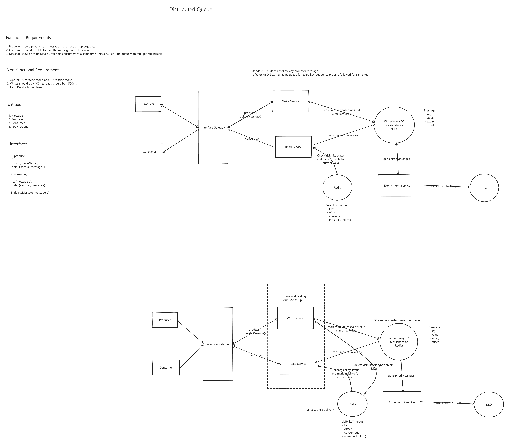

# Distributed Queue

<- [Back to repo](../../README.md) | [Edit diagram](./distributed-queue.excalidraw)

## Functional requirements

1. Producer publishes a message to a topic / queue.
2. Consumer can read messages from the queue.
3. A message is not processed by multiple competing consumers at once (unless pub/sub with independent subscribers).

## Non-functional requirements

1. ~**1M writes/s**, ~**2M reads/s** (order-of-magnitude design target).
2. Write p99 < **100ms**, read p99 < **500ms**.
3. High durability (multi-AZ).

## Entities / APIs

| Piece | Role |
|-------|------|
| **produce(topic, data)** | Append message |
| **consume()** | Receive message (+ id) |
| **deleteMessage(id)** / ack | Complete processing |
| **Message** | key, value, expiry, offset |
| **VisibilityTimeout** | key, offset, consumerId, `invisibleUntil` |

## Challenges / key points

| Challenge | What to say |
|-----------|-------------|
| **At-least-once** | Default: after crash / timeout, message is delivered again. Consumers **must be idempotent**. |
| **Exactly-once** | Broker "exactly-once mode" != business exactly-once. Achieve **exactly-once effect** via inbox / unique `(eventId)` + conditional writes. |
| **Visibility timeout (SQS-style)** | After receive, message is **invisible** until timeout; ack/delete removes it; if worker dies, it becomes visible again -> retry. |
| **Kafka offset** | Commit offset **after** side effect; no commit -> same offset retried (partition blocked until progress). |
| **Retry / DLQ** | Cap receive count / delivery attempts -> **DLQ**; alert; don't poison-loop forever. |
| **Ordering** | Not global. FIFO SQS / Kafka: order **per key / group / partition**. Standard SQS: no order. |
| **Pub/sub vs work queue** | Competing consumers share one queue; independent readers = separate queues / consumer groups. |
| **Hot key / partition** | Skewed keys melt one shard; salt or redesign key when order allows. |
| **Durability** | Multi-AZ replication; don't ack before durable write if loss is unacceptable. |
| **Scale** | Shard queues / partitions; consumers ~= partitions (Kafka consumer group). |

## Related docs

- [Kafka vs RabbitMQ vs SQS](../../docs/messaging-and-pipelines.md#kafka-vs-rabbitmq-vs-sqs)
- [Inbox / dedupe](../../docs/messaging-and-pipelines.md#inbox-dedupe-table)
- [Retries make outages worse](../../docs/reliability-and-slos.md#retries-make-outages-worse)
- [Idempotency](../../docs/core-concepts.md#idempotency)
