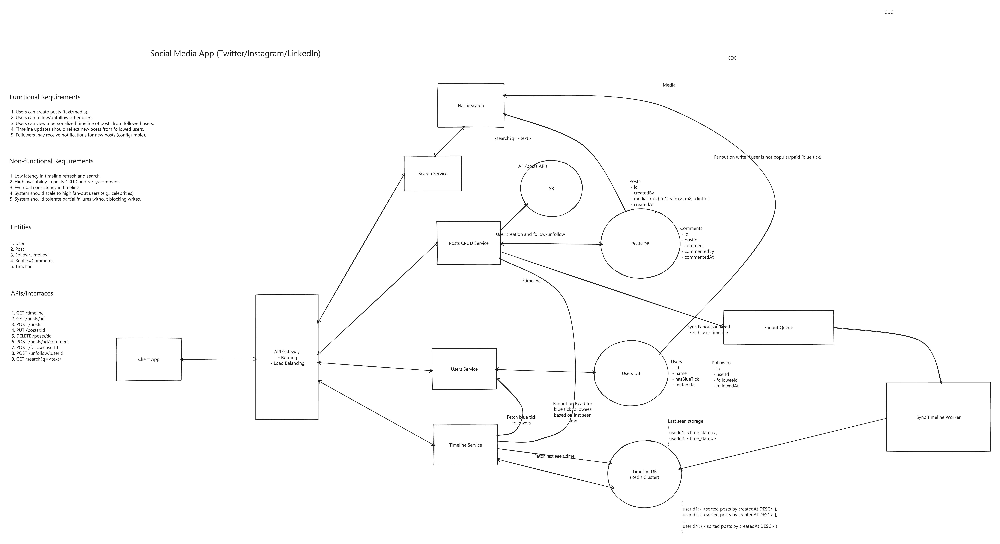

# Social Media / News Feed

<- [Back to repo](../../README.md) | [Edit diagram](./social-media-app.excalidraw)

## Functional requirements

1. Users can create posts (text / media).
2. Users can follow / unfollow other users.
3. Users can view a **personalized timeline** of posts from followed users.
4. Timeline should reflect new posts from followees.
5. Followers may get notifications for new posts (configurable).

## Non-functional requirements

1. Low latency timeline refresh and search.
2. High availability for posts CRUD and comments.
3. Eventual consistency for timeline.
4. Scale to **high fan-out** users (celebrities).
5. Tolerate partial failures without blocking writes.

## Entities / components

| Piece | Role |
|-------|------|
| **User / Follow graph** | Follow / unfollow edges |
| **Post** | Content + metadata; system of record |
| **Timeline store** | Per-user precomputed feed (sorted by `createdAt`) |
| **Fanout queue / workers** | Push new posts into followers' timelines |
| **Search** | Optional keyword path over posts |
| **Notification path** | Optional alert on new post |

## APIs (board)

- `GET /timeline`, `GET /posts/:id`
- `POST|PUT|DELETE /posts`, `POST /posts/:id/comment`
- `POST /follow/:userId`, `POST /unfollow/:userId`
- `GET /search?q=`

## Challenges / key points

| Challenge | What to say |
|-----------|-------------|
| **Fan-out on write vs fan-in on read** | Normal users: **fan-out on write** into followers' timeline caches. Celebrities / blue-tick: **fan-out on read** (merge at read time) so one post doesn't write to 50M timelines. |
| **Hybrid** | Board: fan-out on write if not popular; fan-out on read for blue-tick followees based on last-seen. |
| **Timeline refresh size** | Never load "all posts". Return a **page** (limit + cursor / last `createdAt`) -- e.g. 20-50 rows per refresh; client pulls next page. |
| **Write path vs feed path** | Post write goes to durable store first; fan-out is async so celebrity post doesn't block HTTP. |
| **Partial failure** | Fan-out worker lag -> timeline eventual; user still sees own post; repair / backfill missing slots. |
| **Hot key / celebrity** | Don't fan-out on write to millions; isolate celebrity read merge + cache. |
| **Cache invalidation** | Timeline entries are projections; deletes/edits need invalidation or versioned post payloads. |
| **Search vs feed** | Separate index/path; feed is social graph order, search is relevance. |

## Related docs

- [Fan-out on write vs read](../../docs/core-concepts.md#fan-out-on-write-vs-read)
- [Cursor vs offset](../../docs/algorithms-and-indexes.md#cursor-vs-offset-paginated-queries)
- [Caching](../../docs/caching.md)
- [Services vs workers](../../docs/service-architecture.md#services-vs-workers)
